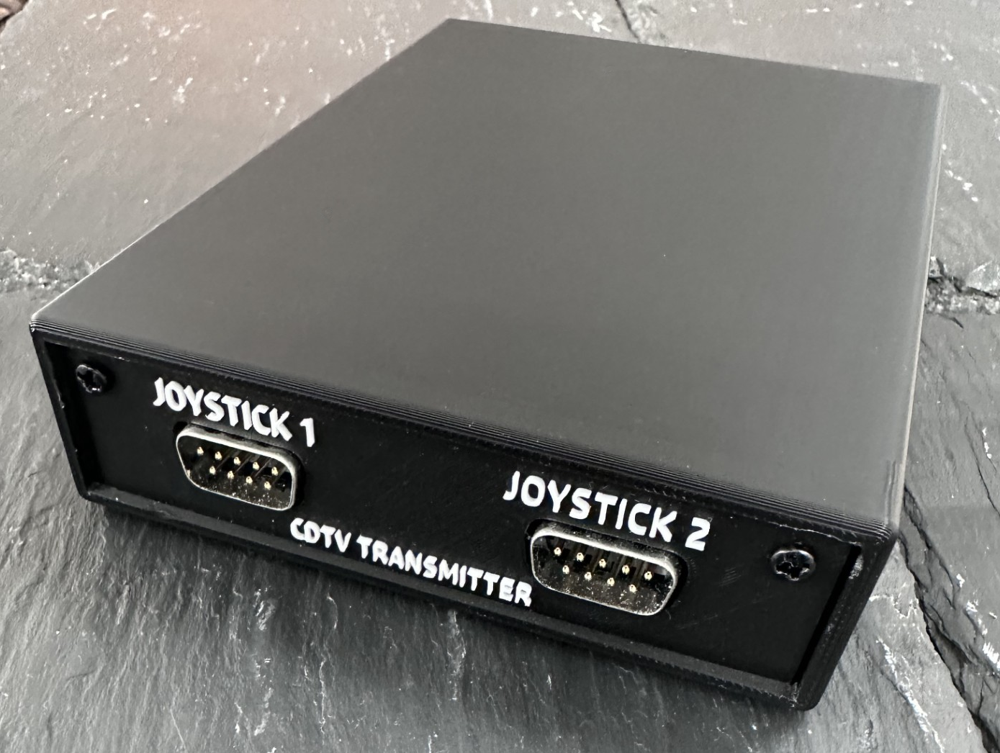
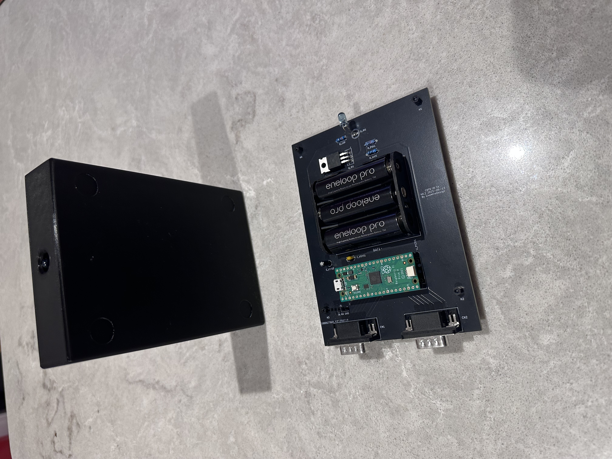

# CDTV IR Transmitter – 3D-Printable Enclosure

This repository contains the 3D print files for the custom enclosure used in my **Commodore CDTV Dual-Joystick IR Transmitter** project.  
The design houses a Raspberry Pi Pico-based PCB, a 3×AA battery pack, dual DE-9 joystick connectors, and an IR LED driver.

You can also find it on MakerWorld https://makerworld.com/en/models/1804520-commodore-cdtv-2-joystick-ir-transmitter-enclosure

The original 1991 Brick design reminded me of an Amiga floppy drive, so I matched its general dimensions and appearance. This provided ample space for the components and added a satisfying heft.

---
 |

## Overview

The case was modelled in Fusion 360 and printed on a Bambu Lab P1S using PLA.  
It provides a snug, screw-together housing for the full PCB assembly, keeping the batteries secure while giving the DE-9 joystick ports a clean, retro look.

 

# Bare Board Option
If you’d rather keep the board bare, you can simply fit nylon hex standoffs (sometimes called threaded spacers or PCB pillars) into the four mounting holes. These lightweight supports lift the PCB a few millimetres off the surface, preventing the solder joints or header pins from scratching furniture or shorting against anything conductive. Nylon is ideal because it’s non-conductive and won’t mark the desk, but brass or aluminium standoffs can also be used if you need extra rigidity. Just screw them in or use snap-fit pillars and the board will stay safely elevated without a full enclosure.

---

## Files Included

| File | Purpose |
|------|--------|
| **CDTV-IR-Transmitter.step** | Full parametric CAD model for editing in Fusion 360, FreeCAD, or any STEP-compatible CAD package. |
| **CDTV-IR-Transmitter.3mf** | Ready-to-print Bambu Studio (3MF) project with recommended orientation and print settings. |
| **top-front.png** | Render/photo of the finished enclosure showing the labelled front panel. |
| **bottom-top.jpg** | Photo of the internal PCB and battery layout for reference. |
| **README.md** | This document. |

You can also download these files on [MakerWorld](https://makerworld.com/en/models/1804520-commodore-cdtv-2-joystick-ir-transmitter-enclosure).

---

## Printing Notes
- **Material:** PLA or PETG  
- **Layer Height:** 0.2 mm  
- **Infill:** 20% grid (or your preferred setting)  
- **Supports:** Not required if printed as supplied  
- **Fasteners:** 2 × M3×8 mm machine screws (for use with the optional heat-set inserts)

The STEP file allows easy editing if you wish to resize the case or change connector cut-outs.

---

## Assembly

1. Solder and fully test the PCB before assembly.  
2. Gently bend the IR LED so it aligns with the case opening, and—if needed—tilt the MOSFET for clearance.  
3. Slide the board along the internal runners, ensuring the IR LED sits correctly in the front hole and points straight ahead.  
4. (Optional) Heat-set two threaded inserts into the base mounting holes for a stronger screw joint.  
5. Fit the front face-plate and guide the DE-9 connectors neatly through their cut-outs.  
6. Attach the face plate, securing it with two screws to match your inserts.

---

## Possible Improvements
1. Add a side cut-out for USB (power) access to the Pico.  
   *Note: the Pico’s central placement makes convenient cable routing awkward.*  
2. Design a more robust power-switch mount.  
   *Bear in mind that extra holes or external switches may compromise the case’s clean look.*  
3. Refine the faceplate fit for easier removal so battery replacement is easier.  
   *It’s currently very snug and can stay in place without screws, but you need to tug the joysticks to remove it.*

Enjoy building your own CDTV IR Transmitter enclosure and feel free to remix or adapt the design!
