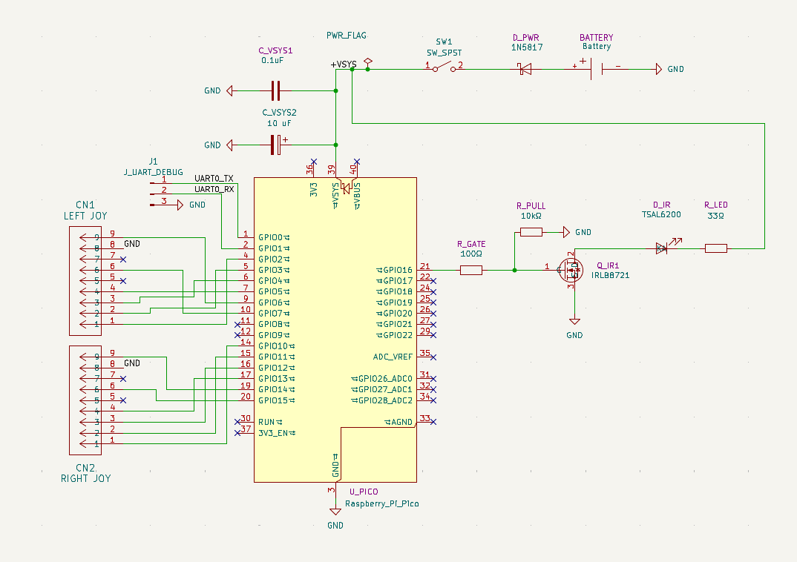

# 📖 Electronics Design for the CDTV IR Controller

This README describes the **electronics design** for a modern replacement of the **Commodore CDTV infrared controllers**.  
It focuses on the hardware built around a **Raspberry Pi Pico (RP2040 or RP2350)** microcontroller, which reads two standard DE-9 joysticks and transmits their states to the CDTV via an **infrared LED driver circuit**.  

The README is organised into three main sections:  

- **🎮 Joystick Circuit** – how the DE-9 ports connect to the Pico, and why they are joystick-only.  
- **🔋 Power Circuit** – how batteries, diodes, and capacitors provide stable power for the Pico and LED.  
- **📡 IR LED Circuit** – how the MOSFET, resistors, and LED generate the CDTV-compatible IR output.  

Additional sections provide:  
- Technical notes on why mice cannot be used with these DE-9 connectors.  
- An overview of the **Amiga/CDTV mouse protocol** for reference.  
- Trade-offs between resistor values and LED current output for builders who want to tune brightness vs. battery life.  

👷 **Who is this for?**  
This README is written for **builders and electronics hobbyists** who want to reproduce, understand, or modify the CDTV IR controller hardware.  
It explains not just *what components are used*, but also *why they are there*, with calculations, alternatives, and practical design trade-offs.

---

## 🧰 Why Through-Hole Components?

This design deliberately uses **through-hole (THT) components** rather than surface-mount (SMD). 

The unit needs to be a little **heavy and bulky** so it doesn’t get dragged around by the joystick cables during frantic gameplay, helping it retain line-of-sight to the CDTV’s IR receiver. 

### Reasons for Through-Hole
- **Large mechanical parts**:  
  - The **battery holder**, **IR LED**, and **DE-9 joystick connectors** are inherently large and designed as through-hole parts.  
  - The **Raspberry Pi Pico module** itself is also a through-hole DIP board.  
  - These parts set the minimum size of the PCB — it will never be a tiny design.  
- **Ease of assembly**:  
  - Through-hole parts are much easier to solder by hand, making this build accessible to hobbyists with basic tools.  
  - Component orientation is clear, and mechanical strength is higher for connectors and switches that will see stress.  
- **Component availability**:  
  - THT resistors, diodes, capacitors, and headers are cheap and widely available.  
  - Builders can source them from almost any electronics supplier or salvage them from donor boards.  

### Could this be SMD?
Swapping to SMD would reduce board size **only for the passives** (resistors, capacitors, pull-ups).  
However:  
- **Battery holders, LEDs, DE-9 connectors, and the Pico** remain large and through-hole.  
- The actual PCB reduction would be modest because the layout must still accommodate these large footprints.  
- SMD would complicate soldering for beginners and make the design harder to reproduce at home.  

---

## 📐 Schematic

---

## 🎮 Joystick Circuit

All joystick ground pins (CN1/CN2), battery negative, and Pico GND must share the same reference. VSYS after the Schottky diode is the main supply rail for both the Pico and the IR LED driver circuit.

| Component | Purpose in Design | Reason | Alternative Options |
|-----------|------------------|--------|----------------------|
| **U_PICO1 Raspberry Pi Pico** | Main microcontroller (RP2040 or RP2350) that reads joystick inputs and encodes them for IR transmission. All joystick lines are pulled to GND when active, and read as logic LOW by the Pico. VSYS powers the board and sets the logic level reference. | Cheap, widely available, powerful enough for real-time IR modulation. Plenty of GPIO pins for two DE-9 ports. | Arduino Nano/Pro Mini (requires redesign for I/O mapping), STM32 “Blue Pill”. |
| **CN1 / CN2 (DE-9 connectors)** | Standard joystick connectors (Atari/Amiga compatible). Each pin corresponds to joystick direction or fire buttons. Internally wired to Pico GPIO, with common GND pins tied to system GND. **Pin 5 (potentiometer X)** and **Pin 7 (+5 V supply)** are unused. | DE-9 is the Amiga standard, ensures physical compatibility. Right-angle THT sockets are robust for repeated plug/unplug cycles. | Any through-hole DE-9 connector (straight or right-angle). Panel-mount DE-9 with short wires for mechanical flexibility. |

### Notes on Unused Pins
- **Pin 5 (Pot X / analogue input)** – On the original Amiga this is used for analogue paddles or light pens. This design is digital-only, so the pin is left unconnected.  
- **Pin 7 (+5 V supply)** – Provides +5 V to mice and other powered peripherals. Since this board does not support mice and is battery-powered, +5 V is not provided to avoid backfeeding or damaging the Pico.  

### DE-9 Joystick Pinout (per port)

| DE-9 Pin | Function | Pico GPIO |
|----------|----------|-----------|
| 1        | Up       | GP2 / GP10 |
| 2        | Down     | GP3 / GP11 |
| 3        | Left     | GP4 / GP12 |
| 4        | Right    | GP5 / GP13 |
| 6        | Fire 1   | GP7 / GP15 |
| 9        | Fire 2   | GP6 / GP14 |
| 8        | GND      | GND        |
| 5, 7     | NC/+5V   | Not used   |

### ⚠️ Autofire

Autofire is unreliable here (as it was on the original CD1200). Classic autofire works with a direct digital connection and is powered from +5 V on Pin 7.  In this design the Pico must clock and convert joystick inputs into a serial IR stream, so the rapid autofire pulses cannot be transmitted reliably.

---

## 🔋 Power Circuit

All joystick ground pins (CN1/CN2), battery negative, and Pico GND must share the same reference. VSYS after the Schottky diode is the main supply rail for both the Pico and the IR LED driver circuit.

| Component | Purpose in Design | Reason| Alternative Options |
|-----------|------------------|---------------------------|----------------------|
| **BAT1 (Battery holder)** | Provides portable AA battery supply | 3 × AA is the Pico’s standard input range (VSYS). Delivers ~3.6 V with NiMH and ~4.5 V with Alkaline. After the Schottky diode drop this becomes ~3.25 V (NiMH) or ~4.15 V (Alkaline), which is ideal for the IR LED drive calculations. | Li-ion 18650 3.7 V cell with protection + charging circuit (but requires regulator for safe Pico supply). |
| **D_PWR1 1N5817 (Schottky diode)** | Reverse-current protection and source OR-ing between USB and battery. Prevents backfeeding into the batteries when USB is plugged in. | Very low forward drop (0.2–0.4 V), preserving as much voltage as possible for the LED. Rated for >1 A, so well above the 100 mA load. | 1N5819 (slightly higher drop), SS14 (SMD equivalent). |
| **C_VSYS1 0.1 µF ceramic capacitor** | Local high-frequency decoupling at the Pico VSYS pin. Suppresses fast transients from the IR LED switching and keeps supply stable at the microsecond scale. | Small MLCCs have very low ESR and respond quickly. This value is a “standard bypass” close to the IC. | 0.47 µF or 1 µF ceramic (improves HF filtering further). |
| **C_VSYS2 10 µF electrolytic capacitor** | Bulk smoothing capacitor. Handles lower-frequency voltage dips caused by the IR LED pulsing at 40 kHz. | 10 µF provides enough charge reservoir to stop Pico resets during bursts. Electrolytic tolerates ripple current better than ceramic alone. | 22 µF or 47 µF for longer battery leads or higher burst currents. |
| **SW1 SPST switch** | Physical battery isolation. Breaks connection between the pack and the diode, allowing complete shutdown without USB unplugging. | Slide switches are compact, tactile, and easy to panel-mount. Current rating is comfortably above draw. | Rocker switch (more robust), latching push-button. |

---

## 📡 IR LED Circuit

The IR LED is driven at 40 kHz with a duty cycle <50%, so the average current is well below the peak. This allows safe operation even when instantaneous current approaches the LED’s maximum continuous rating.

| Component | Purpose in Design | Reason | Alternative Options |
|-----------|------------------|---------------------------|----------------------|
| **D_IR1 TSAL6200 IR LED** | The main emitter. A high-power 940 nm IR LED that converts current pulses into IR light detectable by the CDTV receiver. Forward voltage ~1.35 V at 100 mA, with a 200 mA peak rating. | Wide angle (±20°), high radiant intensity, and spectral match to standard IR demodulators. Handles short current bursts without thermal runaway. | TSAL4400 (narrower 10° beam, longer range), SFH4546 (high-power emitter). |
| **Q_IR1 IRLB8721 (MOSFET)** | Low-side switch for the LED. Takes PWM drive from the Pico and switches LED current through R_LED1. Its low Rds(on) (<20 mΩ) ensures almost no voltage drop, so current is defined by the resistor not the MOSFET. | Logic-level gate threshold (<2 V), meaning it fully enhances with Pico’s 3.3 V output. Robust current handling (tens of amps), way above the sub-0.1 A required here. | IRLZ34N (similar spec, slightly higher Rds(on)), AO3400 (SMD, low gate charge). |
| **R_LED1 33 Ω resistor** | Series current-limiting resistor. Ensures the LED does not exceed its safe forward current by dropping the excess supply voltage. At ~4.15 V (alkaline supply after Schottky drop), current ≈ (4.15 V − 1.35 V)/33 Ω ≈ 85 mA. | Provides reliable current limiting independent of battery type. Keeps LED near 100 mA continuous spec but well under 200 mA pulsed limit. Dissipation ≈ 0.24 W at full current, so a 0.25 W or 0.5 W resistor is appropriate. | 27 Ω (≈100 mA, brighter but hotter), 39 Ω (≈70 mA, dimmer but saves battery). |
| **R_PULL1 10 kΩ** | Gate pull-down resistor. Holds MOSFET gate at 0 V when Pico GPIO is in reset, boot, or high-impedance state. Without it, the gate capacitance could float high and partially turn on the MOSFET, causing LED ghost flicker. | 10 kΩ provides a defined low with negligible current draw from the Pico. Value is not critical—just needs to bleed off gate charge slowly. | 4.7 kΩ (stronger pull-down, faster discharge), 22 kΩ (weaker pull, less leakage). |
| **R_GATE1 100 Ω resistor** | Gate series resistor. Sits between Pico GPIO and MOSFET gate to limit instantaneous charging/discharging current into the gate capacitance (~1 nF). Prevents ringing, reduces EMI, and protects the GPIO driver. | 100 Ω gives a good compromise: Pico can still switch gate fast enough for 40 kHz IR PWM, but without dumping tens of mA into the GPIO pin. | 68 Ω (faster switching, slightly more stress), 220 Ω (slower switching, lower stress). |

## 🔢 IR LED Resistor Trade-offs

| Resistor | Supply   | I_LED (mA) | P_R (mW) | P_LED (mW) |
|----------|----------|------------|----------|------------|
| 27 Ω     | Alkaline | 103.7      | 290.4    | 140.0      |
| 27 Ω     | NiMH     | 70.4       | 133.7    | 95.0       |
| 33 Ω     | Alkaline | 84.8       | 237.6    | 114.5      |
| 33 Ω     | NiMH     | 57.6       | 109.4    | 77.7       |
| 39 Ω     | Alkaline | 71.8       | 201.0    | 96.9       |
| 39 Ω     | NiMH     | 48.7       | 92.6     | 65.8       |

---

## 🛠️ Debug / Programming Header

| Component | Purpose in Design | Reason | Alternative Options |
|-----------|------------------|--------|----------------------|
| **J1 (3-pin header)** | Breaks out the Pico’s UART for debugging or programming. | Provides a serial console during development, useful for logging joystick states or IR timing. Simple 3-pin header keeps it compact. | Any 3-pin 2.54 mm header. Could also break out full SWD (3 or 5-pin) for low-level debugging. |

### Pinout (J1)
| Pin | Signal | Notes |
|-----|--------|-------|
| 1   | GND    | Common ground reference |
| 2   | TX     | Pico TX (connect to RX of USB–UART adapter) |
| 3   | RX     | Pico RX (connect to TX of USB–UART adapter) |

⚠️ **Note for builders**:  
- This header is optional if you only intend to flash `.uf2` files via USB.  
- It is strongly recommended during early development or troubleshooting IR timings.  
- Keep the ground pin connected whenever using an external UART adapter to avoid floating reference issues.

---

## 🖱️ Amiga / CDTV Mouse Protocol (and why it is not supported here)

It is important to understand that although Amiga/CDTV joysticks and mice share the same DE-9 connector format, the **signals and requirements are completely different**.

- A **joystick** is just a set of switches. Each direction or fire button shorts its pin to GND when pressed. The Pico can read these directly as active-low digital inputs.  
- An **Amiga mouse** is not switch-based. It uses two quadrature encoders that continuously generate pulse trains on the direction pins as the ball moves. These need to be sampled and decoded in real time.  
- The mouse also expects a **+5 V supply** on Pin 7 of the DE-9 to power its encoders. This design deliberately does not supply 5 V, because it is joystick-only.

### Important clarification  
The **Commodore CD1200 trackball** (the inspiration for this project) also **did not present mouse signals** on its DE-9 ports. Those pins were never wired for mouse use. Instead:  
- The **trackball** in the CD1200 produced its own data stream.  
- That stream used a variation of the **CDTV IR mouse protocol** (serial, not quadrature).  
- Mouse support in the CDTV therefore came from the **dedicated IR mouse (CD-1252) and wired mouse (CD-1253)**, not from the DE-9 joystick sockets.  

### Why mice are not supported here (YET!)
This project replicates the CD1200’s joystick behaviour, not the IR mouse. Supporting mice would require:  
- Supplying +5 V on Pin 7.  
- Capturing and decoding quadrature pulses at high speed.  
- Translating movement into the CDTV’s proprietary IR mouse serial protocol.  

Since the original CD1200 never offered mouse inputs on its DE-9 ports, this design remains **joystick-only** — just like the original hardware.

---

## 📡 CDTV Mouse Serial Protocol

For builders who want to experiment with adding mouse support, here are the key details of the **CDTV mouse protocol** (used by CD-1252 IR and CD-1253 wired mice):

## 📡 CDTV Mouse Serial Protocol

The CDTV mouse (CD-1252 IR / CD-1253 wired) uses a proprietary asynchronous serial protocol.  

- **Frame structure**:  
  - **Start bit**: 1100 µs low pulse, 375 µs high.  
  - **19 data bits**: transmitted MSB first.  
  - **Stop bit**: 100 µs line held low.  

- **Bit encoding** (each bit = ~875 µs total):  
  - **0** = ~500 µs low, ~375 µs high.  
  - **1** = ~150 µs low, ~725 µs high.  

- **Contents of the 19 data bits**:  
  - **Mouse flag** (always `1` to indicate mouse device).  
  - **Button states**: `left` and `right` button down/up.  
  - **X movement**: `8` bit signed value.  
  - **Y movement**: `8` bit signed value.  

- **Timing**:  
  - Packets sent every ~32 ms while the mouse is moving.  
  - There is a ~14 ms gap between frames.  
  - Idle state is a steady HIGH level.  

---
## 🔚 Next Steps

With the electronics design understood, builders can:

1. **Assemble the PCB** – start with resistors and small passives, then add connectors, the Pico, and finally the battery holder and IR LED.  
2. **Build your image** – see the `root` directory for Pico source code.  
3. **Test the IR output** – confirm joystick presses translate into IR frames using a Amiga Test Kit or an oscilloscope.  
4. **Enclose the build** – use the provided 3D-printed case files to house the PCB, ensuring the IR LED has clear line-of-sight to the CDTV receiver.  

This README covers the **hardware design**. For the **firmware details**, please refer to the dedicated firmware documentation in the directory above.
