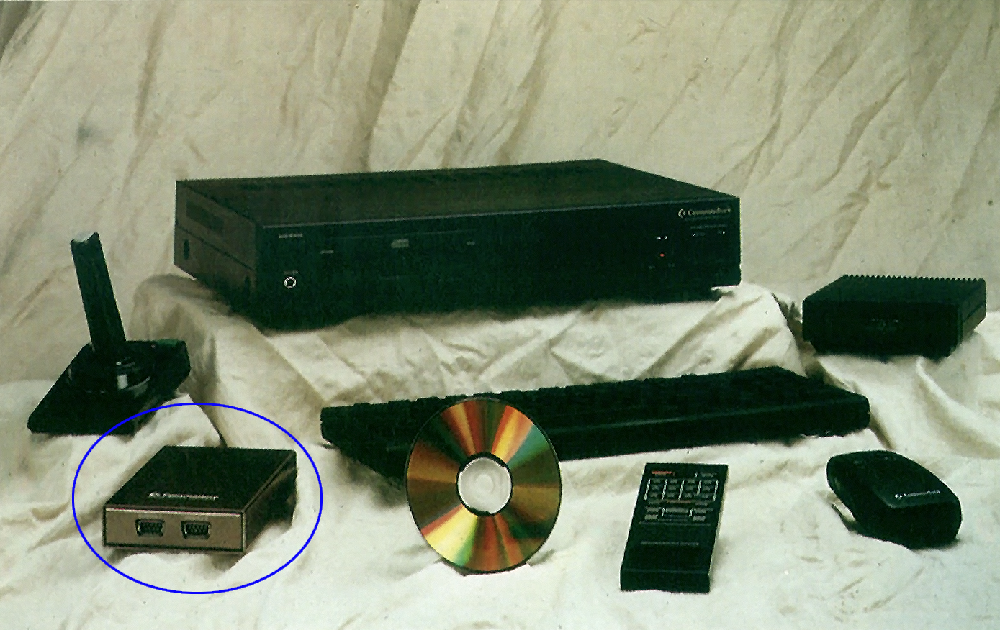
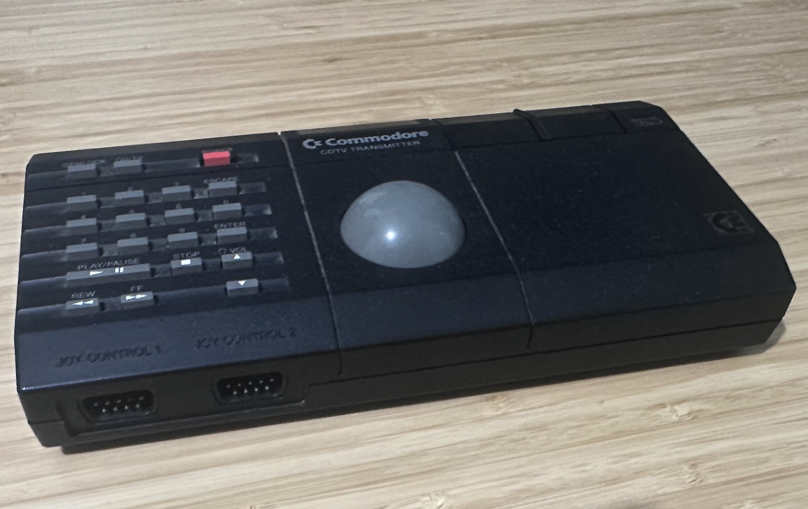

# The Commodore CDTV Brick 
## Two-player IR joystick interface

*The original Brick*

The circled **Commodore CDTV Brick** was a 1990s CDTV input device that sadly never made it to retail shelves. Instead, it appears that its functionality was integrated into the **Commodore CDTV CD1200** (below). The design of this Brick is entirely based on reverse engineering the protocols from the **CD1200 Trackball**, **CD1252/CD1253 mice**, **Brickette**, and the **CDTV Remote**.

*The CD1200, obtain via a mortgage!!*

*The Prototype Brick!*

## Project Overview
This  purpose of this project is to help makers design and build new devices, as the original retro mice, remote and trackerball command heavy prices second hand so there is an eager market for cheaper alternatives, without these input devices the CDTVs I fear will end up in landfill! 

The Pico project simply takes joystick input over GPIO, converts it to the IR protocol, and transmits it to an IR LED via a MOSFET. The code in this repro is for the Raspberry Pi Pico, both the RP2040 or newer RP2350 work fine. Visual Studio Code and the Offical Raspberry Pi Pico Extension were used to build the code. Everything is vanilla so should be easy enough to compile. The implementation is intentionally minimal for clarity, to enable ports to other MCUs, but there are known limitations:

1. **PWM vs PIO**: It may be preferable to use Pico PIO, as demonstrated in the [Pico IR example](https://github.com/raspberrypi/pico-examples/blob/master/pio/ir_nec/README.adoc).
2. **No defensive programming**: There is no error handling or debug output—failures may go unnoticed.
3. **Battery conservation**: No power-saving measures are implemented. The device does not stop timers or reduce CPU/PWM load during inactivity.

## Results!

The Brick performs exceptionally well, it enables **wireless two-player simultaneous Amiga gameplay**, testing on titles such as *Battle Squadron*, *SWIV*, *Project X*, *Zool*, and *Superfrog*—all played well without noticeable lag. More importantly, it avoids the need to open up the CDTV, remove chips, or pay upwards of **$1000 for a CD1200 Trackball**.

## Joystick Protocol

The joystick protocol appears to be *undocumented!* but here is the specification for use in your own devices:

- **Carrier frequency**: 40 kHz  
- **Duty cycle**: 33%

### Signal Encoding

Both mouse and joystick protocols use the same bit encoding:

| Bit | Mark (µs) | Space (µs) | Total (µs) |
|-----|-----------|------------|------------|
| 0   | 150       | 725        | 875        |
| 1   | 500       | 375        | 875        |

> All timing values should divide evenly by 25.

### Joystick Frame Structure

- **Header**: `1100` mark followed by `375` µs space  
- **Payload**: 25 bits total   
  - `1` flag for joystick (0 = joystick, 1 = mouse)  
  - `12` bits for two joystick inputs: F2, F1, U, D, L, R, F2, F1, U, D, L, R  
  - `12` bits for the inverse of the above, acting as a primitive check bit  
- **Footer**: `800` µs space (no specific footer signal)  
- **Frame duration**: ~24,150 µs (≈41 frames per second)  
- **Transitions per frame**: 52

When the user stops using the joystick, **four consecutive frames of all zeros** are sent. After that, the device ceases transmission, as there's little point repeatedly telling the CDTV that nothing is being pressed. This behaviour matches the CD1200 functionality.

## Brickette Protocol Comparison

The **Brickette** was a wired device similar to the CD1200 using a nearly identical joystick protocol with longer timings:

- **Header**: 1400 µs mark followed by 500 µs space  
- **Bit encoding**:

| Bit | Mark (µs) | Space (µs) | Total (µs) |
|-----|-----------|------------|------------|
| 0   | 150       | 1000       | 1150       |
| 1   | 650       | 500        | 1150       |

- **Frame duration**: ~32,000 µs (≈31 frames per second)

The Brickette is approximately **25% more latent** than the CD1200. This is likely because it transmits at the slower clock rate required for mouse support, which also operates at 31 frames per second. The Brickette also does **not** send the four “end of transmission” frames, leaving the CDTV unaware when the user stopped pressing joystick directions. This behaviour can be observed in **Amiga Test Kit**.

## How to build & install

1. Building PCB documentation is there [KiCad/README.md](KiCad/README.md). You'll find the gerber file, schematics and the BOM. **WARNING : there is an error in the schematics. You need to reverse the polarity of the IR LED**
2. Open current project in VSCode.
3. `F5` to build and debug (if you've got a Raspberry Pi Debug Probe) or `F7` to just build.
4. Then plug you're Raspberry Pico on your computer and copy into it the file `build/Brick.uf2`, it should disconnect automatically.
5. That's all.

## Acknowledgements

This project was inspired by the excellent research and historical insights shared on [CDTV Land](https://cdtvland.com/2021/03/07/cdtv-brick-prototype/) regarding the elusive CDTV Brick prototype. 

---

